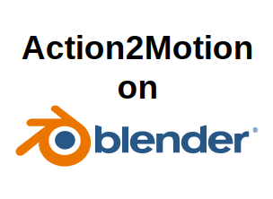
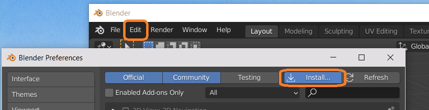
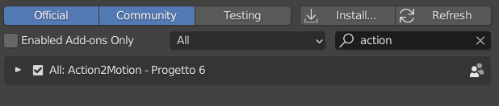
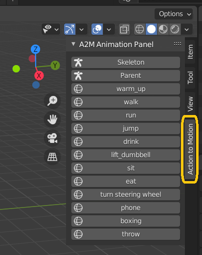
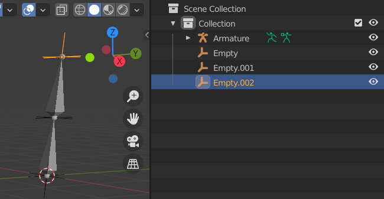
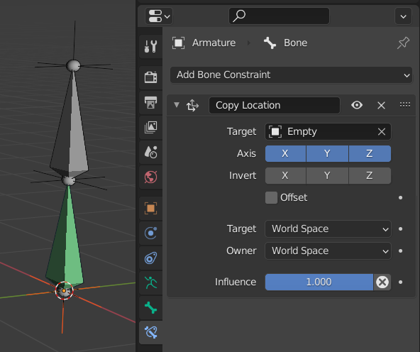
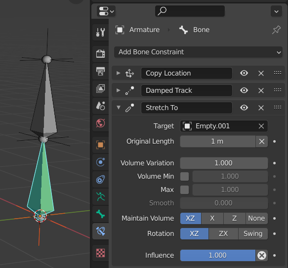
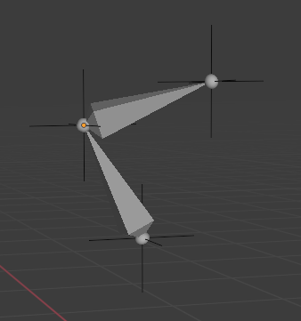

<!-- PROJECT LOGO -->
<br />
<p align="center">
  


  <h3 align="center">Action2Motion: Conditioned Generation of 3D Human Motions On Blender</h3>

<p align="center">  </p>
</p>


<!-- TABLE OF CONTENTS -->
<details open="open">
  <summary>Table of Contents</summary>
  <ol>
    <li>
      <a href="#about-the-project">About The Project</a>
    </li>
    <li>
      <a href="#getting-started">Getting Started</a>
      <ul>
        <li><a href="#prerequisites">Prerequisites</a></li>
        <li><a href="#installation">Installation</a></li>
      </ul>
    </li>
    <li><a href="#usage">Usage</a></li>
    <li><a href="#link-bones">Link Bones</a></li>
    <li><a href="#roadmap">Roadmap</a></li>
    <li><a href="#contributing">Contributing</a></li>
    <li><a href="#license">License</a></li>
    <li><a href="#contact">Contact</a></li>
    <li><a href="#acknowledgements">Acknowledgements</a></li>
  </ol>
</details>


<!-- ABOUT THE PROJECT -->
### About The Project


There are many great README templates available on GitHub, however, I didn't find one that really suit my needs so I created this enhanced one. I want to create a README template so amazing that it'll be the last one you ever need -- I think this is it.

Here's why:
* Your time should be focused on creating something amazing. A project that solves a problem and helps others
* You shouldn't be doing the same tasks over and over like creating a README from scratch
* You should element DRY principles to the rest of your life :smile:

Of course, no one template will serve all projects since your needs may be different. So I'll be adding more in the near future. You may also suggest changes by forking this repo and creating a pull request or opening an issue. Thanks to all the people have have contributed to expanding this template!

A list of commonly used resources that I find helpful are listed in the acknowledgements.

### Built With

This section should list any major frameworks that you built your project using. Leave any add-ons/plugins for the acknowledgements section. Here are a few examples.
* [Bootstrap](https://getbootstrap.com)
* [JQuery](https://jquery.com)
* [Laravel](https://laravel.com)


<!-- GETTING STARTED -->
## Getting Started

This is an example of how you may give instructions on setting up your project locally.
To get a local copy up and running follow these simple example steps.

### Prerequisites

This is an example of how to list things you need to use the software and how to install them.
* npm
  ```sh
  npm install npm@latest -g
  ```

### Installation

1. Download the .zip file from this repository

3. Open Blender > Edit > Preferences > Add-ons > Install
   <p align="center"></p>

3. Activate the checkbox. It will takes a few minutes to install the Add-on due the libraries size that the Neural Network uses (at least 3Gb)
   <p align="center"></p>
  
4. This is the panel that will appear
   <p align="center"></p>


<!-- USAGE EXAMPLES -->
## Usage

Use this space to show useful examples of how a project can be used. Additional screenshots, code examples and demos work well in this space. You may also link to more resources.

_For more examples, please refer to the [Documentation](https://example.com)_

<!-- USAGE EXAMPLES -->
## Link Bones ciaoooo

This is an example of how to link bones with Empty "Plain Axes". <a href="https://blender.stackexchange.com/questions/30835/convert-a-c3d-and-trc-files-to-bvh"> Source </a>

First we need to make an Armature (in this example it's made of 2 bones only).
Then we add a "Plain Axes" for each joint. The latters may be placed in the exact bones joints' coordinates.

 <p align="center"></p>

Now we select the Armature and move to the Pose Mode.

It's the moment to select and add constraints for each bone. In the following image you can see the constraints "Copy location" that move the selected head's bone to the definited Plain Axes' location.

 <p align="center"></p>

There is not a straight-forward way to move the bone's tail with only one constraint. In order to make each tail following a certain Plain Axes we use two constrains: "Damped Track" and "Strech to". 

The "Damped Track" constraint makes the tail point towards the definited Plain Axes object.
Then, the "Strech to" stretches up to the definited Plain Axes object.

 <p align="center"></p>

Now, from Object Mode, if we move a Plain Axes object, the linked Bone follows it.

 <p align="center"></p>


<!-- ACKNOWLEDGEMENTS -->
## Acknowledgements
* [Action2Motion: Conditioned Generation of 3D Human Motions](https://github.com/EricGuo5513/action-to-motion)


<!-- MARKDOWN LINKS & IMAGES -->
<!-- https://www.markdownguide.org/basic-syntax/#reference-style-links -->
[contributors-shield]: https://img.shields.io/github/contributors/paoloros97/Action2Motion_OnBlender.svg?style=for-the-badge
[contributors-url]: https://github.com/paoloros97/Action2Motion_OnBlender/graphs/contributors
[forks-shield]: https://img.shields.io/github/forks/paoloros97/Action2Motion_OnBlender.svg?style=for-the-badge
[forks-url]: https://github.com/paoloros97/Action2Motion_OnBlender/network/members
[stars-shield]: https://img.shields.io/github/stars/paoloros97/Action2Motion_OnBlender?style=for-the-badge
[stars-url]: https://github.com/paoloros97/Action2Motion_OnBlender/stargazers
[issues-shield]: https://img.shields.io/github/issues/paoloros97/Action2Motion_OnBlender.svg?style=for-the-badge
[issues-url]: https://github.com/paoloros97/Action2Motion_OnBlender/issues
[license-shield]: https://img.shields.io/github/license/paoloros97/Action2Motion_OnBlender.svg?style=for-the-badge
[license-url]: https://github.com/othneildrew/Best-README-Template/blob/master/LICENSE.txt
[linkedin-shield]: https://img.shields.io/badge/-LinkedIn-black.svg?style=for-the-badge&logo=linkedin&colorB=555
[linkedin-url]: https://linkedin.com/in/othneildrew
[product-screenshot]: images/screenshot.png
