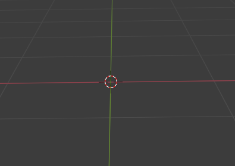
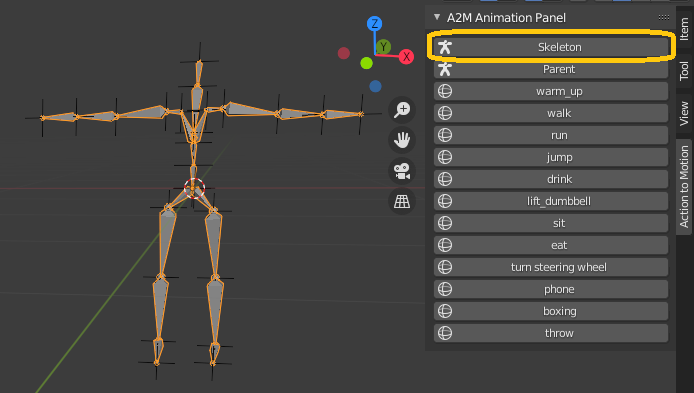
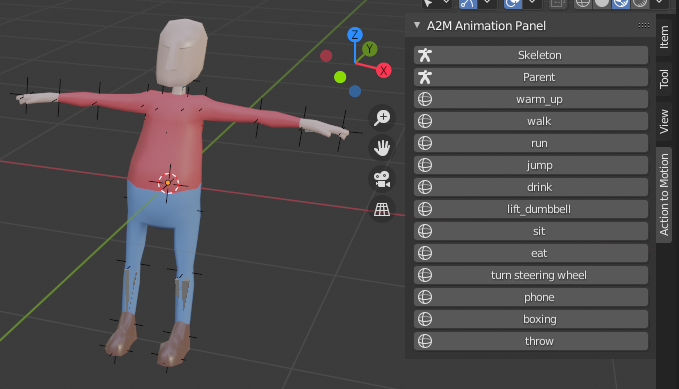
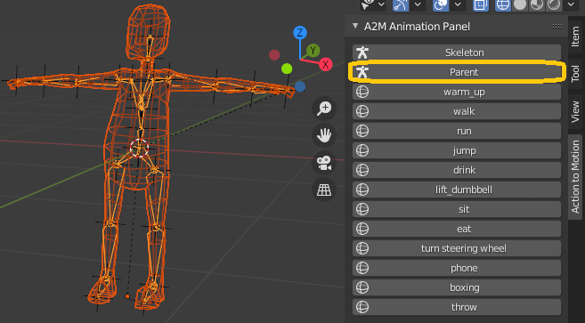
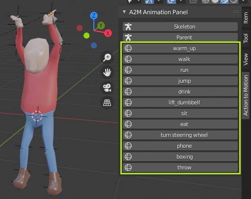

<!-- PROJECT LOGO -->
 

  

  <h3 align="center">Action2Motion: Conditioned Generation of 3D Human Motions _On Blender</h3>

  
   
        <a href="https://cursos.blendtuts.es/products/masterclass-de-personajes-lowpoly/categories/4451937/posts/14949215">Character source</a>

<!-- TABLE OF CONTENTS -->

  
Table of Contents

  <ol>
    <li>
      <a href="#about-the-project">About The Project</a>
    </li>
    <li>
      <a href="#getting-started">Getting Started</a>
      <ul>
        <li><a href="#prerequisites">Prerequisites</a></li>
        <li><a href="#installation">Installation</a></li>
      </ul>
    </li>
    <li><a href="#usage">Usage</a></li>
    <li><a href="#link-bones">Link Bones</a></li>
    <li><a href="#acknowledgements">Acknowledgements</a></li>
  </ol>

<!-- ABOUT THE PROJECT -->
### About The Project

Project 6

The animation of a characters is always very complex task, but using neural networks we can get excellent starting results, so then we can make the necessary improvements.

We have created an add-on for Blender that integrates the <a href="https://github.com/EricGuo5513/action-to-motion">Action2Motion</a> neural network.

From its output we make the bones of the character move. Then, being linked with the character's mesh, we make it move as well. 

📺 <a href="https://www.youtube.com/watch?v=qe0SkQ_q8gU">Video DEMO - Action2Motion_OnBlender (Youtube)</a>

<!-- GETTING STARTED -->
## Getting Started

### Prerequisites

In order to install this Add-on, you need:

* At least 3-4 Gbytes of space in your HD (<a href="https://pytorch.org/get-started/locally/">pytorch</a> with CUDA weighs at least 3Gbyte)
* <a href="https://www.blender.org/">Blender</a> installed

This Add-on has been tested on Windows systems only.

This Add-on has been tested on Blender version 2.92.0.

It can be used both on CPU only devices, and with dedicated GPU (Nvidia CUDA) ones.

### Installation

1. Download this repository (.zip): _Code_ > _Download ZIP_. Please do not un-zip it. Please do not change the main folder name inside the compressed file.

3. Open Blender and go to: Edit > Preferences > Add-ons > Install. Browse the project zip file and load it.
   

3. Activate the checkbox. The first time it will takes a few minutes to install the Add-on due the libraries size that the Neural Network uses (at least 3Gb)
   

  
4. This is the panel that will appear:
   

<!-- USAGE EXAMPLES -->
## Usage

1. Open Blender and empty the whole scene.

  

  
2. Open the _Action2Motion_ panel and click the _Skeleton_ button.
  
  

  
3. Paste your character onto the skeleton. If necessary adjust the bones inside the character in edit mode.

  

4. Push the _Parent_ button to link the _Armature_ with the character mesh.

  

5. Choose a motion and click it. The neural network will generate the selected motion. 

  

   
6. Push the _Play_ button to start the animation.

  
 

<!-- USAGE EXAMPLES -->
## Link Bones

This is an example of how to link bones with Empty "Plain Axes". <a href="https://blender.stackexchange.com/questions/30835/convert-a-c3d-and-trc-files-to-bvh"> Source </a>

First we need to make an Armature (in this example it's made of 2 bones only).
Then we add a "Plain Axes" for each joint. The latters may be placed in the exact bones joints' coordinates.

 

Now we select the Armature and move to the Pose Mode.

It's the moment to select and add constraints for each bone. In the following image you can see the constraints "Copy location" that move the selected head's bone to the definited Plain Axes' location.

 

There is not a straight-forward way to move the bone's tail with only one constraint. In order to make each tail following a certain Plain Axes we use two constrains: "Damped Track" and "Strech to". 

The "Damped Track" constraint makes the tail point towards the definited Plain Axes object.
Then, the "Strech to" stretches up to the definited Plain Axes object.

 

Now, from Object Mode, if we move a Plain Axes object, the linked Bone follows it.

 

<!-- ACKNOWLEDGEMENTS -->
## Acknowledgements
* [Action2Motion: Conditioned Generation of 3D Human Motions](https://github.com/EricGuo5513/action-to-motion)

<!-- MARKDOWN LINKS & IMAGES -->
<!-- https://www.markdownguide.org/basic-syntax/#reference-style-links -->
[contributors-shield]: https://img.shields.io/github/contributors/paoloros97/Action2Motion_OnBlender.svg?style=for-the-badge
[contributors-url]: https://github.com/paoloros97/Action2Motion_OnBlender/graphs/contributors
[forks-shield]: https://img.shields.io/github/forks/paoloros97/Action2Motion_OnBlender.svg?style=for-the-badge
[forks-url]: https://github.com/paoloros97/Action2Motion_OnBlender/network/members
[stars-shield]: https://img.shields.io/github/stars/paoloros97/Action2Motion_OnBlender?style=for-the-badge
[stars-url]: https://github.com/paoloros97/Action2Motion_OnBlender/stargazers
[issues-shield]: https://img.shields.io/github/issues/paoloros97/Action2Motion_OnBlender.svg?style=for-the-badge
[issues-url]: https://github.com/paoloros97/Action2Motion_OnBlender/issues
[license-shield]: https://img.shields.io/github/license/paoloros97/Action2Motion_OnBlender.svg?style=for-the-badge
[license-url]: https://github.com/othneildrew/Best-README-Template/blob/master/LICENSE.txt
[linkedin-shield]: https://img.shields.io/badge/-LinkedIn-black.svg?style=for-the-badge&logo=linkedin&colorB=555
[linkedin-url]: https://linkedin.com/in/othneildrew
[product-screenshot]: images/screenshot.png
